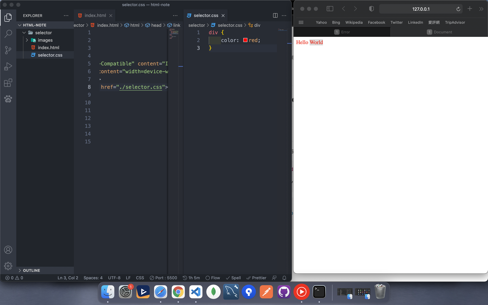
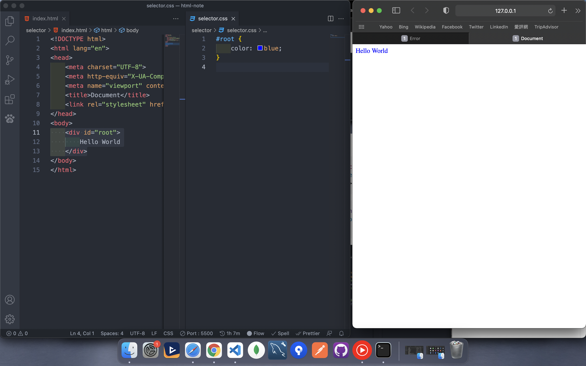
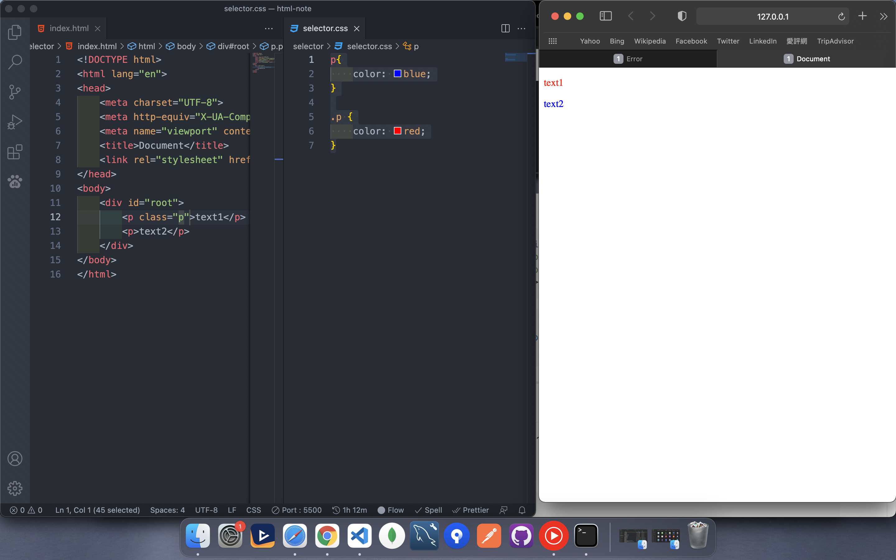
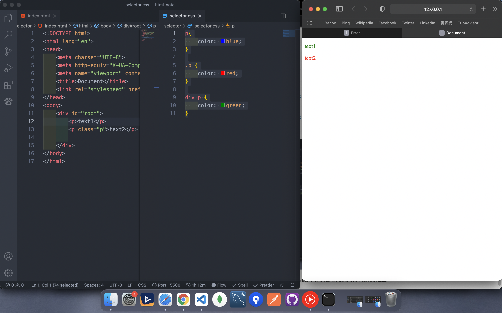
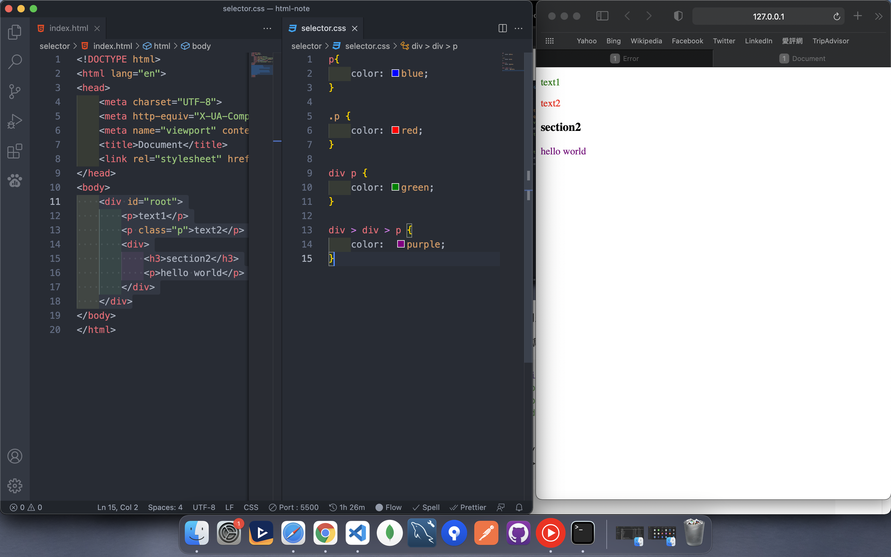
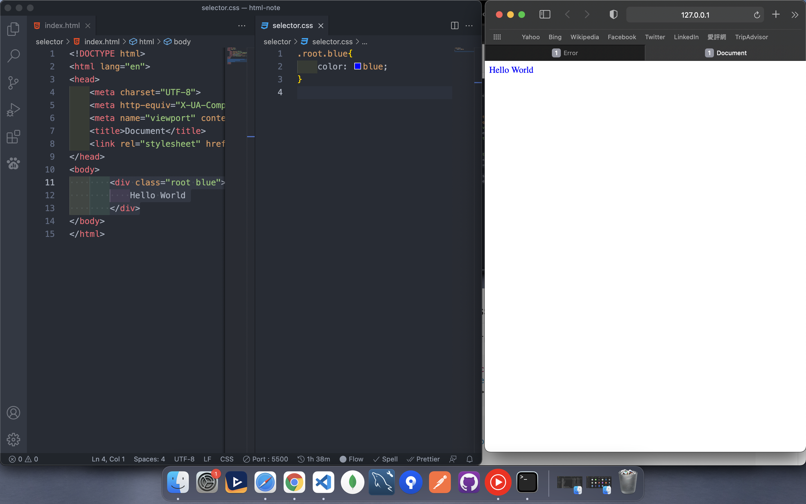

# CSS

## Table of Contents
  - [selector](#selector)
  - [weighting](#weighting)
  - [multi class](#multi-class)
  - [prefix](#prefix)
  - [SASS/SCSS](#sassscss)
  - [Flex](#flex)
  - [Grid](#grid)
---

## selector
* element
* class
* id
* group


`element`

```html
<div>
    Hello World
</div>
```
```css
div {
    color: red;
}
```




`class`

```html
<div class="parent">
    Hello World
</div>
```
```css
.parent {
    color: blue;
}
```


`id` 
```html
<div id="root">
    Hello World
</div>
```

```css
#root {
    color: blue;
}
```



`*`

```html
<div id="root">
    <p>text1</p>
    <p>text2</p>
</div>
```

```css
* {
    color: blue;
}
```

---
[⬆️ back to Contents](#table-of-contents)


## weighting
* element = 1
* class = 10
* id = 100

```css
p {
    color: blue;
}

.p {
    color: red;
}
```



我們可以發現class的寫法權重比較高,所以把元素的選擇器蓋過

id選擇器
```html
<div id="root">
    <p class="p">text1</p>
    <p id="text" class="p">text2</p>
</div>
```

```css
p{
    color: blue;
}

.p {
    color: red;
}
#text {
    color: green;
}
```


當然我們也可以使用依序選取元素的方式累加權重

```html
<div id="root">
    <p>text1</p>
    <p class="p">text2</p>
</div>
```

```css
p{
    color: blue;
}

.p {
    color: red;
}

div p {
    color: green;
}
```



但這樣會有個問題,變成只要div中有p的元素,就會被選取

我們透過 `>`強調,是該元素的子元素才會被選取

```html
<div id="root">
    <p>text1</p>
    <p class="p">text2</p>
    <div>
        <h3>section2</h3>
        <p>hello world</p>
    </div>
</div>
```

```css
p{
    color: blue;
}

.p {
    color: red;
}

div p {
    color: green;
}

div > div > p {
    color:  purple;
}
```



---
[⬆️ back to Contents](#table-of-contents)


## multi class 

假設我只想讓有root跟blue類別的元素顏色變藍

```html
<div class="root blue">
    Hello World
</div>
```

```css
.root .blue {
    color: blue;
}
```


我們可以發現這樣是錯誤的,在類別的後面不能留空格

```css
.root.blue{
    color: blue;
}
```



來看另外一個例子

```html
<div class="root blue">
    <p>text1</p>
    <p class="purple">child</p>
</div>
```

```css
.root.blue{
    color: blue;
}
.root .purple {
    color: purple;
}
```


由此可知我們大概了解在CSS中的空格相當於元素中的子元素

---
[⬆️ back to Contents](#table-of-contents)


## prefix
在各瀏覽器中實現CSS都不太相同
常常我們需要在前面加上
* -webkit- (Chrome 、Safari)
* -moz- (Firefox)
* -ms- (Ie)

如果特效或是動畫較多,一定要先使用下面的網站查詢是否支援該屬性
[can i use ?](https://caniuse.com/)

```css
-webkit-backdrop-filter: blur(10px)
```
[⬆️ back to Contents](#table-of-contents)

## SASS/SCSS
[uide](https://sass-lang.com/guide)

SASS/SCSS是CSS的預處理器,最終還是會轉譯成CSS


而SCSS和SASS最主要的差別在於

SCSS一樣維持跟CSS一樣有Block,而SASS則是縮排方式

SCSS


SASS


---

[⬆️ back to Contents](#table-of-contents)

## display
* inline
* block
* inline-block
* none

### block
元素保有換行、間距,可設置width

```html
    <div>
        <p>Lorem, ipsum dolor sit amet consectetur adipisicing elit. Laboriosam <p class="inline">Hello</p>pmodi perferendis soluta mollitia totam iure, quidem neque ex sapiente! Quasi modi enim quidem molestias error laboriosam et hic laudantium harum.</p>
    </div>
```

```css
.inline {
    background-color: yellow;
    color: red;
    display: block;
}
```


### inline
元素沒有block效果,與旁邊的元素成同一行,並且沒辦法更改width

```css
.inline {
    background-color: yellow;
    color: red;
    display: inline;
}
```


### inline-block
保有上下兼具,也能和周圍元素同一行,並且能更改width

```css
.inline {
    background-color: yellow;
    color: red;
    display: inline-block;
}
```


---

[⬆️ back to Contents](#table-of-contents)

## Flex
* flex-grow
* flex-shrink
* flex-basis

```html
<div class="container">
    <div class="left">1</div>
    <div class="right">2</div>
</div>
```


添加CSS之後

```css
.container {
    text-align: center;
    display: flex;
}
.left, .right {
    flex-basis: 100px;
}
.left {
    background-color: yellow;
}
.right {
    background-color: red;
}

```


---

### flex-basis
預設flex的元素為多少寬

```css
.container {
    text-align: center;
    display: flex;
}
.left, .right {
    flex-basis: 100px;
}
.left {
    background-color: yellow;
}
.right {
    background-color: red;
}
```


---

### flex-grow
元素成長的比例
以下左元素為2/3,右元素為1/3

```css
.container {
    text-align: center;
    display: flex;
}
.left, .right {

}
.left {
    background-color: yellow;
    flex-grow: 2;
}
.right {
    background-color: red;
    flex-grow: 1;
}
```


---

### flex-shrink
使元素收縮倍率
```css

```

---

### flex-direction

---

### flex-wrap

---

### justify

---

### align


---
[⬆️ back to Contents](#table-of-contents)

## Grid
---
[⬆️ back to Contents](#table-of-contents)

## Align

---
[⬆️ back to Contents](#table-of-contents)