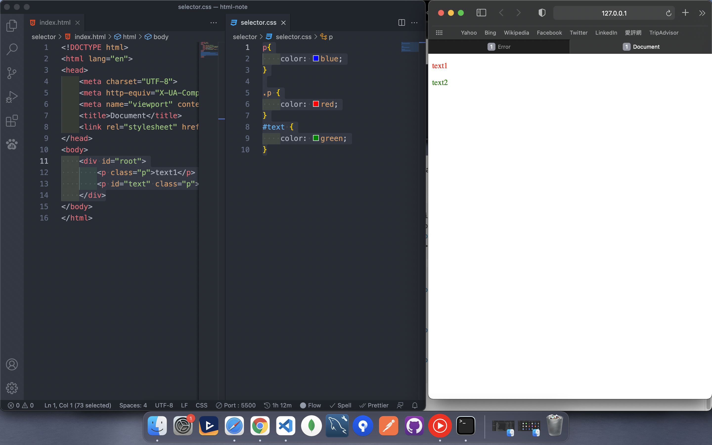

# CSS

## Table of Contents
- [CSS](#css)
  - [Table of Contents](#table-of-contents)
  - [* prefix](#-prefix)
  - [selector](#selector)
  - [weighting](#weighting)
  - [multy class](#multy-class)
  - [prefix](#prefix)
---

## selector
* element
* class
* id
* group


`element`

```html
<div>
    Hello World
</div>
```
```css
div {
    color: red;
}
```


`class`

```html
<div class="parent">
    Hello World
</div>
```
```css
.parent {
    color: blue;
}
```


`id` 
```html
<div id="root">
    Hello World
</div>
```

```css
#root {
    color: blue;
}
```


`*`

```html
<div id="root">
    <p>text1</p>
    <p>text2</p>
</div>
```

```css
* {
    color: blue;
}
```

---

## weighting
* element = 1
* class = 10
* id = 100

```css
p {
    color: blue;
}

.p {
    color: red;
}
```


我們可以發現class的寫法權重比較高,所以把元素的選擇器蓋過

id選擇器
```html
<div id="root">
    <p class="p">text1</p>
    <p id="text" class="p">text2</p>
</div>
```

```css
p{
    color: blue;
}

.p {
    color: red;
}
#text {
    color: green;
}
```




當然我們也可以使用依序選取元素的方式累加權重

```html
<div id="root">
    <p>text1</p>
    <p class="p">text2</p>
</div>
```

```css
p{
    color: blue;
}

.p {
    color: red;
}

div p {
    color: green;
}
```


但這樣會有個問題,會變成只要div中有p的元素,就會被選取

我們透過 `>`強調,是該元素的子元素才會被選取

```html
<div id="root">
    <p>text1</p>
    <p class="p">text2</p>
    <div>
        <h3>section2</h3>
        <p>hello world</p>
    </div>
</div>
```

```css
p{
    color: blue;
}

.p {
    color: red;
}

div p {
    color: green;
}

div > div > p {
    color:  purple;
}
```


---

## multy class 

假設我只想讓有root跟blue類別的元素顏色變藍

```html
<div class="root blue">
    Hello World
</div>
```

```css
.root .blue {
    color: blue;
}
```


我們可以發現這樣是錯誤的,在類別的後面不能留空格

```css
.root.blue{
    color: blue;
}
```


來看另外一個例子

```html
<div class="root blue">
    <p>text1</p>
    <p class="purple">child</p>
</div>
```

```css
.root.blue{
    color: blue;
}
.root .purple {
    color: purple;
}
```


由此可知我們大概了解在CSS中的空格相當於元素中的子元素

---

## prefix
在各瀏覽器中實現CSS都不太相同
常常我們需要在前面加上
* -webkit- (Chrome 、Safari)
* -moz- (Firefox)
* -ms- (Ie)

如果特效或是動畫較多,一定要先使用下面的網站查詢是否支援該屬性
[can i use ?](https://caniuse.com/)

```css
-webkit-backdrop-filter: blur(10px)
```